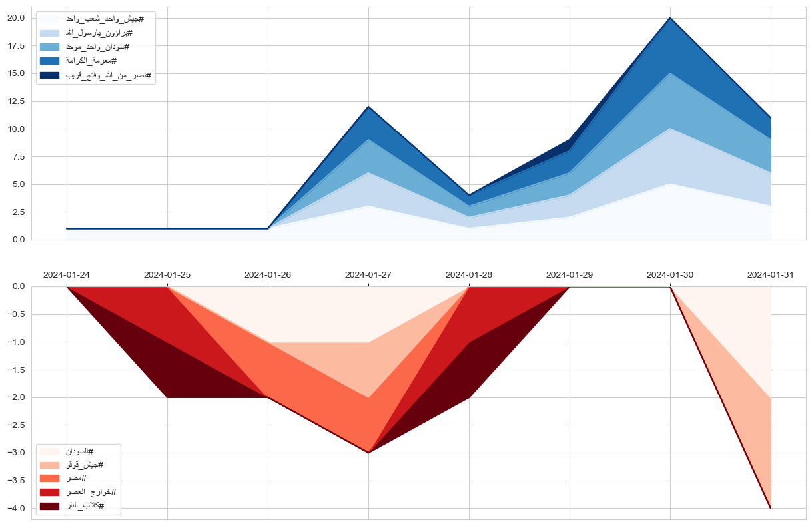
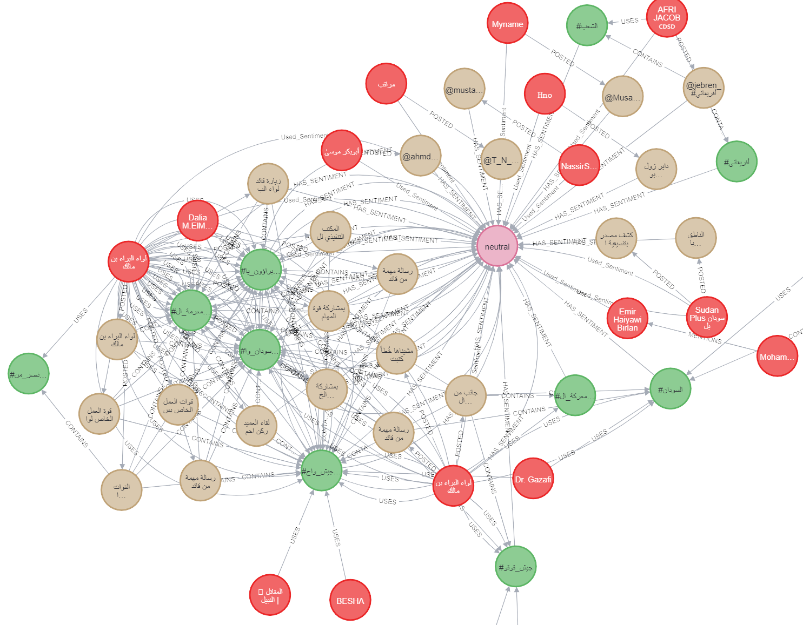

# arabic-polarization-analysis
 This repository contains machine learning models and analysis code for studying polarization dynamics on Arabic (Sudanese) in the context of violent conflict. 

##### This is still an ongoing project and the code is not yet ready for public use. The images below are just a preview of the work in progress.

  
  

<figcaption> (left)Hashtags polarity and volume over the conflict period. (Right)Tweets ,Hashtags and Users sentiment and interactions network</figcaption>
